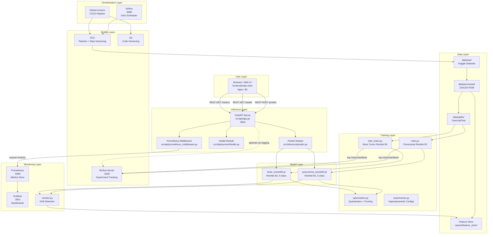

# Architecture — Medical Image Classification MLOps System

## System Architecture Diagram

---

## Block Descriptions

### User Layer
- **Browser / Web UI**: Single-page application (`frontend/index.html`) served by Nginx on port 80. Contains four tabs: Predict, Pipeline, Monitoring, User Manual. Communicates with the API exclusively via REST calls — no direct model or database access.

### Inference Layer
- **FastAPI Server** (`src/api/app.py`): REST API gateway. Routes `/predict`, `/health`, `/healthz`, `/readyz`, `/metrics`. Stateless — each request is independent.
- **Predict Module** (`src/inference/predict.py`): Loads both ResNet-50 models at startup (graceful fallback if missing). Applies image transform, modality detection heuristic, inference with confidence thresholding.
- **Health Module** (`src/deployment/health.py`): Tracks request count, latency histograms, error rates. Powers liveness and readiness probes.
- **Prometheus Middleware** (`src/api/prometheus_middleware.py`): Intercepts every request/response, records HTTP method, endpoint, status code, latency as Prometheus counters/histograms.

### Model Layer
- **pneumonia_resnet50.pt**: ResNet-50 fine-tuned on 5,216 chest X-rays. FC layer → 2 outputs (NORMAL / PNEUMONIA). 90 MB.
- **brain_resnet50.pt**: ResNet-50 fine-tuned on 5,712 brain MRIs. FC layer → 4 outputs (glioma / meningioma / notumor / pituitary). 90 MB.
- Both checkpoints are **baked into the Docker image** — no external storage needed at inference time.

### MLOps Layer
- **MLflow** (`localhost:5000`): Tracks all training runs — hyperparameters, per-epoch metrics, confusion matrices, model signatures. Model registry holds `pneumonia-classifier` and `brain-tumor-classifier` in Staging.
- **DVC**: Versions raw data, processed data, splits, and model artifacts via MD5 checksums in `dvc.lock`. Defines the 13-stage pipeline in `dvc.yaml`.
- **Git**: Versions source code and `dvc.lock`. DVC artifact hashes in git ensure full reproducibility.

### Monitoring Layer
- **Prometheus** (`localhost:9090`): Scrapes `/metrics` from the API every 15s. Stores time-series for HTTP request counts, latency, error rates.
- **Grafana** (`localhost:3001`): Dashboards built on Prometheus data. Auto-provisioned via `grafana/provisioning/`.
- **monitor.py** (`src/monitoring/monitor.py`): Standalone drift detection — computes L1 distribution distance between train/test label distributions, compares feature statistics against baseline. Writes `monitoring_report.json`.

### Training Layer
All training is offline (not in the inference path):
- **train.py / train_brain.py**: Fine-tune ResNet-50 on respective datasets. Log everything to MLflow. Save `.pt` checkpoints locally.
- **optimization.py**: Apply dynamic quantization (CPU) and structured/unstructured pruning. Benchmark latency. Write optimization report.
- **experiments.py**: Define 5 model configurations (resnet50_baseline, resnet50_aggressive, resnet34_lightweight, mobilenet_edge, efficientnet_balanced). Write `model_configs.json`.

### Data Layer
Fully versioned by DVC. Not present in the inference Docker image.
- **data/raw/**: Original Kaggle downloads (23,000+ images).
- **data/processed/**: Resized to 224×224 RGB, corrupt images removed.
- **data/splits/**: Stratified train/val/test splits (brain tumor only — chest X-ray has pre-split folders).
- **Feature Store**: Per-image feature vectors (11 numeric features) + statistical summaries for drift monitoring.

### Orchestration Layer
- **Airflow** (`localhost:8080`): DAG (`dags/ml_pipeline.py`) chains all 13 DVC stages in correct dependency order. Used for scheduled pipeline reruns.
- **GitHub Actions** (`.github/workflows/ci.yml`): On every push — syntax check all modules, validate FastAPI routes, run DVC pipeline validation, build Docker image.

---

## Key Design Decisions

| Decision | Rationale |
|---|---|
| **Models baked into Docker image** | Zero runtime dependencies — deploy anywhere with one `docker run` |
| **Loose coupling via REST** | Frontend only knows the API URL — swappable backend |
| **DVC for pipeline, MLflow for tracking** | DVC handles reproducibility/caching; MLflow handles experiment comparison |
| **MPS → CPU fallback** | Enables fast local training on Apple Silicon while containers use CPU |
| **Docker Compose profiles** | `inference` profile runs standalone in <30s; `training` profile adds MLflow + Postgres |
| **ResNet-50 over ViT/DenseNet** | Best accuracy/latency/size trade-off for 5K–6K image datasets with pretrained weights |
